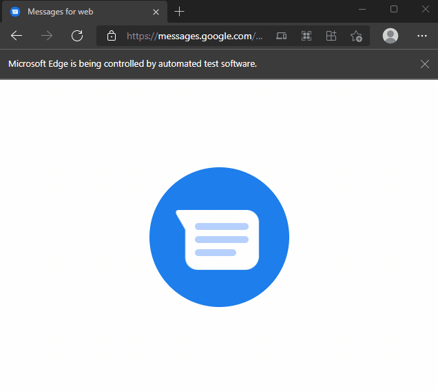

# Messages for web bot
Automatically send text messages using Google [Messages for web](messages.google.com/web)

Python Selenium script that sends bulk text messages to contacts stored in a CSV file



## Features
- Send bulk text messages to contacts defined in CSV file
- Personalize automated text messages with contact name by adding curly braces {} in MESSAGE
- Send text messages to subset of contacts in CSV file via multiple range arguments
- dry_run argument for testing purposes

## Requirements
- [Python 3](https://www.python.org/downloads)
- [selenium](https://pypi.org/project/selenium)
- [msedge-selenium-tools](https://pypi.org/project/msedge-selenium-tools)
- [Microsoft Edge](https://www.microsoft.com/en-us/edge)

## Setup
1. Clone repository
    ```
    git clone https://github.com/rgomezjnr/messages-for-web-bot.git
    ```
2. Install dependencies using pip
    ```
    pip install -r requirements.txt
    ```
3. Download Microsoft Edge webdriver and place in your PATH as described in [Download Microsoft Edge Driver](https://docs.microsoft.com/en-us/microsoft-edge/webdriver-chromium/?tabs=c-sharp#download-microsoft-edge-driver)
4. Pair phone to Microsoft Edge using QR code as described in https://messages.google.com/web/authentication
5. Download/export your contacts CSV file from [contacts.google.com](contacts.google.com), Microsoft Outlook, etc.
6. Edit USER_DATA_DIR in messages-for-web-bot.py. USER_DATA_DIR can be retrieved by navigating to
[edge://version](edge://version) and checking the "Executable path" field. Note it should end in "User Data".
7. Edit PROFILE_DIR in messages-for-web-bot.py. Usually this is "Default". 
8. Run messages-for-web-bot.py from command-line
    ```
    python messages-for-web-bot.py contacts.csv "Hey {}, want to meetup today?"
    ```

## Usage
```
usage: messages-for-web-bot [-h] [-n] [-d DELAY] [-s START_RANGE]
                            [-e END_RANGE] [-r RANGE RANGE] [-v]
                            CONTACTS MESSAGE

Automatically send text messages using Google Messages for web

positional arguments:
  CONTACTS              CSV file containing contacts to send text messages to
  MESSAGE               Content of text message to send to contacts, double-
                        quoted

optional arguments:
  -h, --help            show this help message and exit
  -n, --dry_run         Run script without actually sending text messages
  -d DELAY, --delay DELAY
                        Time delay value between automated browser actions, in
                        seconds
  -s START_RANGE, --start_range START_RANGE
                        Starting row entry in CONTACTS CSV file to send text
                        messages to, inclusive
  -e END_RANGE, --end_range END_RANGE
                        Ending row entry in CONTACTS CSV file to send text
                        messages to, inclusive
  -r RANGE RANGE, --range RANGE RANGE
                        Specify range (row entries) in CONTACTS CSV file to
                        send text messages to
  -v, --version         show program's version number and exit

By default, MESSAGE will be sent to all contacts in CONTACTS CSV file
Add curly brackets {} in MESSAGE to substitute contact name in MESSAGE

Examples

Send text message to all contacts in contacts.csv and substitute contact name in message:
python messages-for-web-bot.py contacts.csv "Hey {}, want to play ball this Friday at 6?"

Send text message to first 10 contacts (row entries 2-11) in contacts.csv:
python messages-for-web-bot.py --end_range 11 contacts.csv "Hello"

Send text message to 12-20 contact entries in contacts.csv:
python messages-for-web-bot.py --range 12 20 contacts.csv "Hello"

Send text message to remaining contacts after row 20 in contacts.csv:
python messages-for-web-bot.py --start_range 21 contacts.csv "Hello"
```

## Support
If you find an issue or have any feedback please submit an issue on [GitHub](https://github.com/rgomezjnr/Messages-for-web-bot/issues).

If you would like to show your support donations are greatly appeciated via:
- [GitHub Sponsors](https://github.com/sponsors/rgomezjnr)
- [PayPal](https://paypal.me/rgomezjnr)
- [Venmo](https://account.venmo.com/u/rgomezjnr)
- [Cash app](https://cash.app/$rgomezjnr)
- [Strike](https://strike.me/rgomezjnr)
- [PayNym:](https://paynym.is/+orangesmoke693) +orangesmoke693
- [Bitcoin:](bitcoin:bc1qh46qmztl77d9dl8f6ezswvqdqxcaurrqegca2p) bc1qh46qmztl77d9dl8f6ezswvqdqxcaurrqegca2p

## Author
[Robert Gomez, Jr.](https://twitter.com/rgomezjnr)

## Source code
https://github.com/rgomezjnr/Messages-for-web-bot

## License
[MIT](https://github.com/rgomezjnr/Messages-for-web-bot/blob/master/LICENSE.txt)
